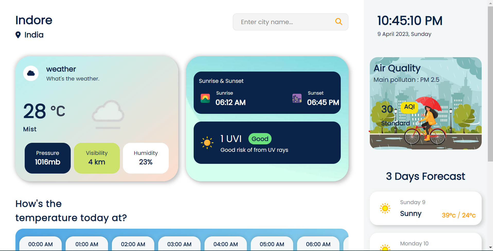
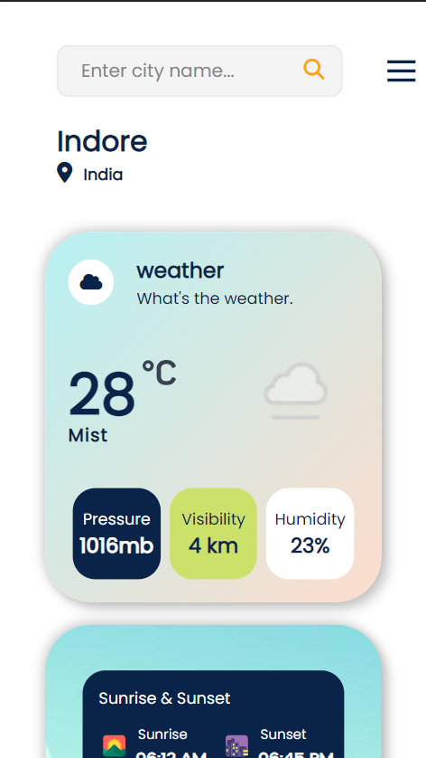

# Weather App

This is a responsive weather website that displays current weather conditions and 3-day weather forecast for a given location.

The website is live and can be accessed at: https://i-vipulpandey.github.io/Weather-App/

Features

- Displays current temperature, humidity, wind speed, and UV index
- Displays 3-day weather forecast including temperature, humidity, wind speed, and UV index
- Supports searching for weather information for any location worldwide
- Automatically detects user's location and displays weather information for that location

Technologies Used

- HTML5
- CSS3 
- JavaScript
- OpenWeather API

Getting Started

To get started with the Weather App, follow these steps:

1- Clone this repository:

git clone https://github.com/i-vipulpandey/Weather-App.git

Alternatively, you can download the project files as a ZIP file from the GitHub repository by clicking the green "Code" button and selecting "Download ZIP".

2- Navigate to the Weather-App directory in your terminal or file explorer.

3- Open the index.html file in your preferred web browser to view the Weather App. Alternatively, you can open the index.html file in your preferred code editor and use a live server extension to view the Weather App in your browser.

4- Search for the location you want to see weather information for in the search bar, or allow the website to detect your current location.

Screenshots

- Desktop View
    

- Mobile View
    

Contributing

If you find any bugs or want to contribute to this project, feel free to create an issue or a pull request.

License
This project is licensed under the MIT License. See the LICENSE file for more information.
  